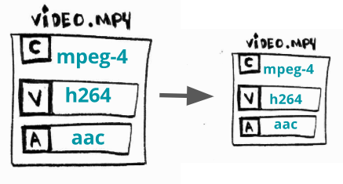

# Intro

## video - what you see

如果你有一个图像序列并以给定的频率进行更改（例如[每秒24张图像](https://www.filmindependent.org/blog/hacking-film-24-frames-per-second/)），你就会产生运动的[错觉](https://en.wikipedia.org/wiki/Persistence_of_vision)。总而言之，这是视频背后的基本概念：**一系列以给定频率更换的图片/帧**。


Zeitgenössische Illustration (1886)

## audio - what you listen

尽管默片（没有声音的视频）也有强大的表达力，但是声音可以带来更好的体验。

> 在数字音频系统中，麦克风将声音转换为模拟电信号，然后模拟电信号转数字信号转换器（ADC）- 通常使用[脉冲编码调制（PCM）](https://en.wikipedia.org/wiki/Pulse-code_modulation) - 将模拟信号转换为数字信号。


>[Source](https://commons.wikimedia.org/wiki/File:CPT-Sound-ADC-DAC.svg)

## codec - shrinking data

> CODEC是一种电子电路或软件，可以 **压缩或解压数字音频/视频。** 它将原始（未压缩）数字音频/视频转换为压缩的格式，反之亦然。
> <https://en.wikipedia.org/wiki/Video_codec>

如果我们将数百万个图像打包到一个文件中并称之为电影（视频），那么最终可能会得到一个体积巨大的文件。让我们来做个计算：

假设我们创建一个分辨率为1080 x 1920（高x宽）的视频，视频每个像素将花费3个字节（屏幕上的最小点）来编码颜色（或[24位颜色](https://en.wikipedia.org/wiki/Color_depth#True_color_.2824-bit.29)），这样能得到16,777,216种不同的颜色），该视频以每秒24帧的速度播放，并且长达30分钟。

```c
toppf = 1080 * 1920 //total_of_pixels_per_frame
cpp = 3 //cost_per_pixel
tis = 30 * 60 //time_in_seconds
fps = 24 //frames_per_second

required_storage = tis * fps * toppf * cpp
```

这个视频大约需要250.28GB的存储空间或1.11Gbps的带宽来在线播放！ 这就是为什么我们需要使用[CODEC](https://github.com/leandromoreira/digital_video_introduction#how-does-a-video-codec-work)。

## container - a comfy place for audio and video

> 容器或称包装器格式是一种元文件格式，描述了计算机文件中不同的数据和元数据元素如何共存。A container or wrapper format is a metafile format whose specification describes how different elements of data and metadata coexist in a computer file.
> <https://en.wikipedia.org/wiki/Digital_container_format>

一个**包含所有流**（主要是音频和视频）的单个文件，它还提供**同步和常规元数据**，例如标题，分辨率等。

通常，我们可以通过查看文件的扩展名来推断文件的格式：例如`video.webm`可能是使用容器[`webm`](https://www.webmproject.org/)的视频。


# Common video operations

## Transcoding


**What?** 将其中一个流（音频或视频）从一个CODEC(编解码器)转换为另一个。

**Why?** 有些时候某些设备（电视，智能手机，控制台等）不支持X，但支持Y，并且更加新的CODEC提供更好的压缩率。

**How?** 将`H264`（AVC）编码的视频转换为`H265`（HEVC）。

## Transmuxing


**What?** 从一种格式（容器）转换为另一种格式

**Why?** 有些时候某些设备（电视，智能手机，控制台等）不支持X，但支持Y，有时新的容器能提供更现代化的功能。

**How?** 将`mp4`转换为`webm`。

## Transrating



**What?** 更改比特率或生成其他副本的行为。

**Why?** 人们会尝试使用功能较弱的智能手机通过`2G`连接或在其4K电视上的`光纤`互联网连接中观看你视频，因此，你应该提供同一视频的多个副本，并使用不同的比特率。

**How?** 生成比特率介于 3856K 和 2000K 之间的副本。

## Transsizing


**What?** 从一种分辨率转换为另一种分辨率

**Why?** 原因与Transrating大致相同。

**How?** 将`1080p`转换为`480p`分辨率。

***
> 本文翻译引用自：[ffmpeg-libav-tutorial](https://github.com/leandromoreira/ffmpeg-libav-tutorial)
