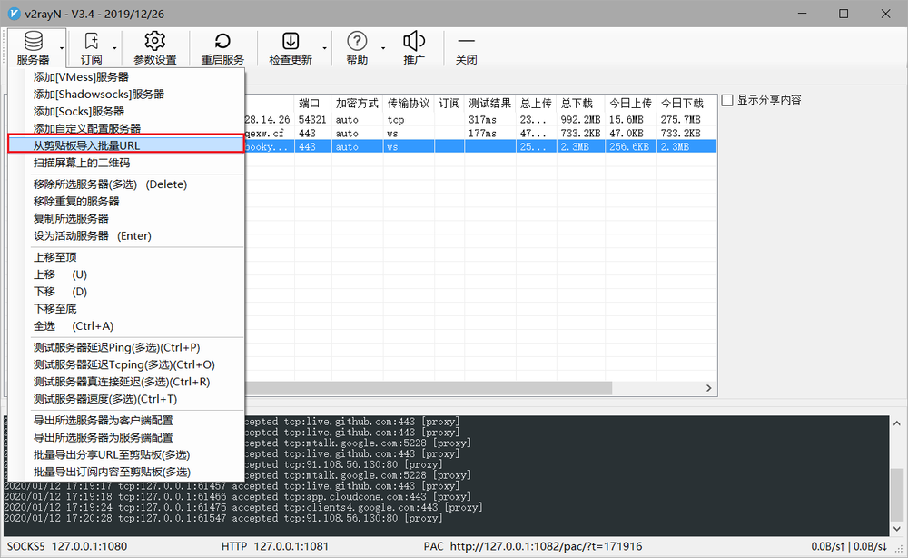
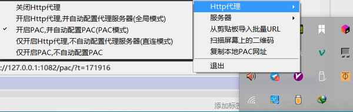
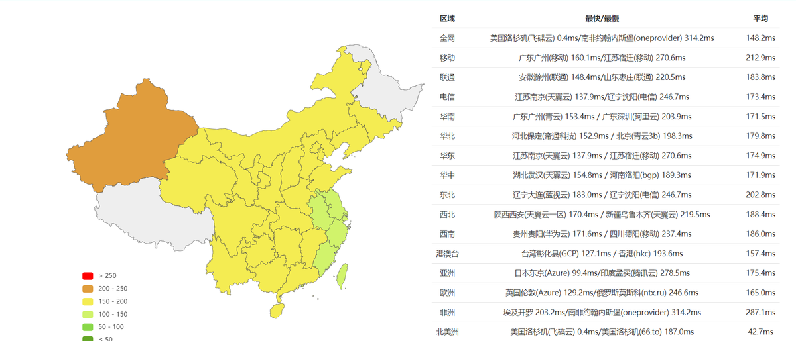

# Pre 科学上网

因为很多工具都需要科学上网/翻墙/富强上网，比如Google，Wikipia，telegram，而这些工具和会用英文检索资料，是程序员路上的一道门槛，跨越这个门槛，水平就会突飞猛进，跨不过，就浑浑噩噩的找份刚好糊口的工作。为了方便大家，这里团队向大家免费提供两种翻墙方式

## jsproxy cf

**使用方式**：打开网址即可使用 <https://jsproxy.bookyue.workers.dev/>
**缺点**：部分同学可能打不开，南方的（广州）同学可能会好一些因为使用的CloudFare提供的free woker，借用CF的CDN线路实现翻墙，但是众所周知的原因，CF在国内的线路质量并不是很好。
**相关资源/料**：

> 1. [《基于 JS Hook 技术，打造最先进的在线代理》](https://github.com/EtherDream/jsproxy/blob/master/docs/blogs/js-hook.md)
> 2. [jsproxy](https://github.com/EtherDream/jsproxy)

## v2ray

**使用方式**:

1. 下载v2ray本地端(这里只说明windows下的工具，Android iOS MacOS Linux *BSD unix等平台不做介绍，请于<https://www.v2ray.com/awesome/tools.html自行食用)>
    > V2RayN 
    > V2RayN 是一个基于 V2Ray 内核的 Windows 客户端。下载：[GitHub](https://github.com/2dust/v2rayN)
    > V2RayU 
    > V2rayU,基于v2ray核心的mac版客户端,界面友好,使用swift4.2编写,支持vmess,shadowsocks,socks5等服务协议,支持订阅, 支持二维码,剪贴板导入,手动配置,二维码分享等。下载：[GitHub](https://github.com/yanue/V2rayU)

2. 复制此链接
    `vmess://ew0KICAidiI6ICIyIiwNCiAgInBzIjogInd3dy5ib29reXVlLnh5eiIsDQogICJhZGQiOiAid3d3LmJvb2t5dWUueHl6IiwNCiAgInBvcnQiOiAiNDQzIiwNCiAgImlkIjogImQ2YzFlNTRmLTNjM2MtNGU5Ni04MzYzLWZjNGUxZjNkMzY2YSIsDQogICJhaWQiOiAiMjMzIiwNCiAgIm5ldCI6ICJ3cyIsDQogICJ0eXBlIjogIm5vbmUiLA0KICAiaG9zdCI6ICJ3d3cuYm9va3l1ZS54eXoiLA0KICAicGF0aCI6ICIvIiwNCiAgInRscyI6ICJ0bHMiDQp9`

    打开v2rayN  
    点击
    

3. 右击右下角v2rayN图标  
    如图所示
    
4. 这个时候你们应该就可以打开Google看一看另一个世界了

    附上中国各地到服务器IP的延迟地图，一般来说，黄色的就已经比较流畅访问了
    

5. 如果你们想更深入的了解，控制特别的网页是否走代理，可以了解一下SwitchyOmega这款插件，Google chrome和Firefox应该都有这款插件，至于怎么用，都已经能上Google了还用问我吗

**相关资源/料**：

1. [v2ray-core](https://github.com/v2ray/v2ray-core)
2. [multi-v2ray](https://github.com/Jrohy/multi-v2ray)
3. [Project V](https://www.v2ray.com/)
4. [v2ray 一键安装脚本 & 管理脚本](https://github.com/233boy/v2ray/tree/master)